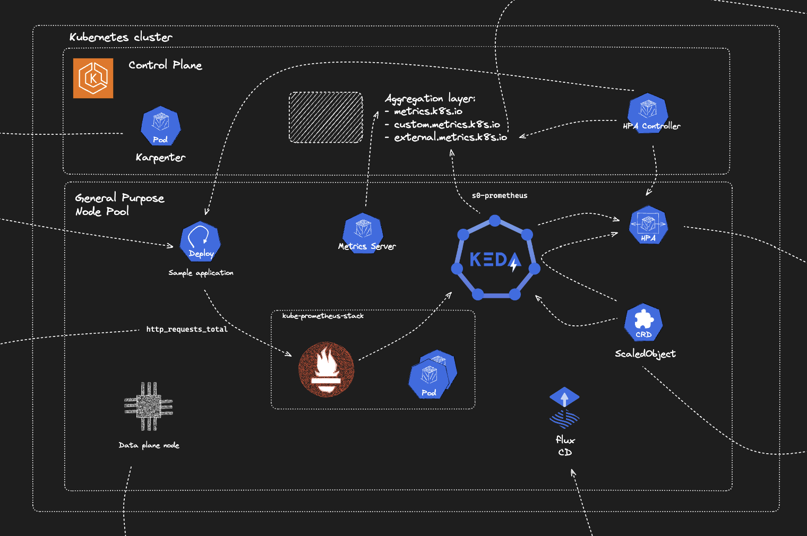

# Event-driven autoscaling for Kubernetes workloads, using KEDA and Prometheus metrics

???

## Architecture

???
- **Milvus**: Vector database for document storage




## Prerequisites

- AWS account
- **Fork this repository** (Flux will commit its files to it)
- it is assumed that commands are executed from Linux-based OS

## Deployment

1. **Setup environment variables**:

As per above, first you need to **fork this repository**, then setup the following environment variables (set `GITHUB_REPO` to the url of your forked repository):

```bash
export CLUSTER_NAME={your cluster name}
export AWS_DEFAULT_REGION={your region}
export GITHUB_TOKEN={GitHub token}
export GITHUB_USER={GitHub user}
export GITHUB_REPO={your forked repo}
```

2. **Create the Amazon EKS cluster**:

```bash
cat << EOF | eksctl create cluster -f -
apiVersion: eksctl.io/v1alpha5
kind: ClusterConfig

metadata:
  name: ${CLUSTER_NAME}
  region: ${AWS_DEFAULT_REGION}

iam:
  withOIDC: true

autoModeConfig:
  enabled: true

EOF
```

7. **Install and bootstrap Flux**

```bash
brew install fluxcd/tap/flux
flux bootstrap github \
--owner=${GITHUB_USER} \
--repository=${GITHUB_REPO} \
--branch=main \
--personal \
--path=eda-keda-prometheus/cluster

```

8. **Monitor deployment progress and wait for completion**

```bash
flux get kustomizations --watch
```

9. **Check deployment**

```bash
kubectl get nodes -o json|jq -Cjr '.items[] | .metadata.name," ",.metadata.labels."beta.kubernetes.io/instance-type"," ",.metadata.labels."beta.kubernetes.io/arch", "\n"'|sort -k3 -r
```

```bash
kubectl get --raw "/apis/external.metrics.k8s.io/v1beta1/namespaces/workload/s0-prometheus?labelSelector=scaledobject.keda.sh%2Fname%3Dexample-app" | jq
```


## Observability

Retrieve Grafana secret:

```bash
kubectl get secret kube-prometheus-stack-grafana -n monitoring -o jsonpath="{.data.admin-password}" | base64 --decode ; echo

kubectl port-forward svc/kube-prometheus-stack-grafana 3000:80 -n monitoring & \

kubectl port-forward pod/prometheus-example-app-69986d5b8-m9zmd 3001:8080 -n workload &

for i in {1..30}
do
    curl http://localhost:3001/
done
```


## Security

See [CONTRIBUTING](CONTRIBUTING.md#security-issue-notifications) for more information.

## License

This library is licensed under the MIT-0 License. See the LICENSE file.