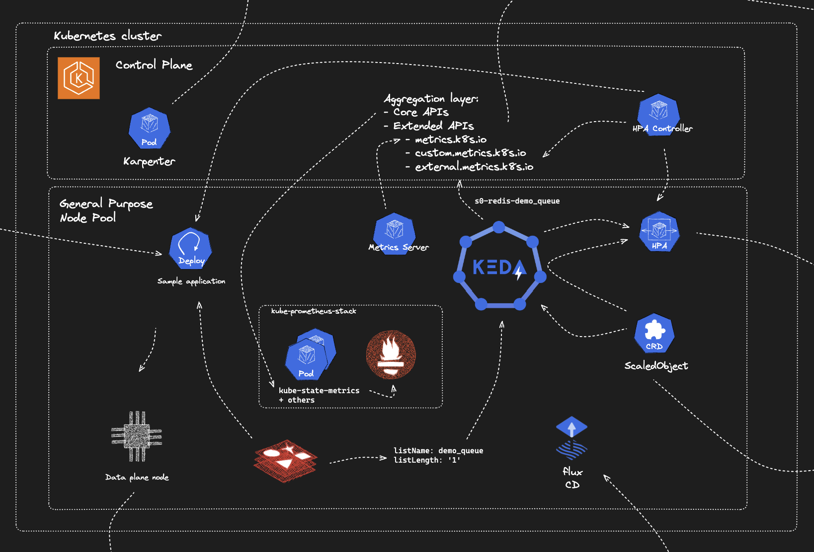

# Event-Driven Autoscaling for Kubernetes Workloads with KEDA and Redis

This repository demonstrates how to implement sophisticated autoscaling in Kubernetes using KEDA (Kubernetes Event-Driven Autoscaler) with Redis queue metrics. The setup showcases horizontal pod autoscaling based on queue depth, scale-to-zero capabilities, and automatic node provisioning with Karpenter.

## Architecture

The solution combines several key components to create a fully automated, event-driven scaling system:

- **KEDA**: Provides event-driven autoscaling capabilities, monitoring Redis queue length for scaling decisions
- **Redis**: Acts as a message queue for background job processing
- **Worker Pods**: Process jobs from the Redis queue with configurable processing time
- **Prometheus**: Collects and stores KEDA and Redis metrics for observability
- **Karpenter**: Automatically provisions and manages EC2 instances based on pod scheduling requirements
- **Flux**: GitOps continuous delivery for declarative cluster management
- **Grafana**: Observability dashboard for monitoring scaling behavior and metrics



## Prerequisites

- AWS account with appropriate permissions
- **Fork this repository** (Flux will commit its configuration files to your fork)
- Linux-based operating system for command execution

## Deployment

### 1. Environment Setup

First, **fork this repository**, then configure the required environment variables:

```bash
export CLUSTER_NAME={your cluster name}
export AWS_DEFAULT_REGION={your region}
export GITHUB_TOKEN={GitHub token}
export GITHUB_USER={GitHub user}
export GITHUB_REPO={your forked repo}
```

### 2. Create Amazon EKS Cluster

Deploy an EKS cluster with OIDC and auto mode enabled:

```bash
cat << EOF | eksctl create cluster -f -
apiVersion: eksctl.io/v1alpha5
kind: ClusterConfig

metadata:
  name: ${CLUSTER_NAME}
  region: ${AWS_DEFAULT_REGION}

iam:
  withOIDC: true

autoModeConfig:
  enabled: true

EOF
```

### 3. Install and Bootstrap Flux

Install Flux CLI and bootstrap GitOps:

```bash
brew install fluxcd/tap/flux
flux bootstrap github \
--owner=${GITHUB_USER} \
--repository=${GITHUB_REPO} \
--branch=main \
--personal \
--path=eda-keda-prometheus/cluster
```

### 4. Monitor Deployment

Watch the deployment progress:

```bash
flux get kustomizations --watch
```

### 5. Verify Initial Setup

Check that nodes are provisioned correctly:

```bash
kubectl get nodes -o json|jq -Cjr '.items[] | .metadata.name," ",.metadata.labels."beta.kubernetes.io/instance-type"," ",.metadata.labels."beta.kubernetes.io/arch", "\n"'|sort -k3 -r
```

Expected output:
```bash
i-09f8cc029971ea2bd c6g.large arm64
i-0cdc488091ff514bd c5.large amd64
i-0ca4843df75cdea84 c5a.large amd64
```

## Understanding Redis Queue-Based Scaling

This demo uses Redis as a message queue for background job processing. The scaling architecture works as follows:

1. **Jobs are pushed** to a Redis list (`demo_queue`)
2. **KEDA monitors** the queue length every 5 seconds
3. **Worker pods scale** based on queue depth (1 pod per job)
4. **Scale-to-zero** when queue is empty
5. **Sustained scaling** with 2-minute job processing time

### Key Components

- **Redis**: Message queue storing jobs as JSON objects
- **Worker Deployment**: Python workers that process jobs from the queue
- **KEDA ScaledObject**: Monitors `demo_queue` length and scales worker pods
- **Redis Exporter**: Exposes Redis metrics to Prometheus for Grafana dashboards

## Understanding Kubernetes API Aggregation and KEDA Integration

The Kubernetes API aggregation layer extends the cluster's API surface without modifying core Kubernetes code. This architecture enables three critical metric APIs:

- **`metrics.k8s.io`**: Basic pod and node resource metrics (CPU, memory)
- **`custom.metrics.k8s.io`**: Application-specific metrics from within the cluster
- **`external.metrics.k8s.io`**: Metrics from external systems (like Redis via KEDA)

KEDA acts as an adapter, implementing both custom and external metrics APIs. It translates Redis queue length into metrics that the Horizontal Pod Autoscaler (HPA) can consume for scaling decisions.

### Examining KEDA Metrics Exposure

Check the external metrics API that KEDA exposes:

```bash
kubectl get --raw "/apis/external.metrics.k8s.io/v1beta1/namespaces/workload/s0-redis?labelSelector=scaledobject.keda.sh%2Fname%3Dredis-worker-scaler" | jq
```

Expected output:
```bash
{
  "kind": "ExternalMetricValueList",
  "apiVersion": "external.metrics.k8s.io/v1beta1",
  "metadata": {},
  "items": [
    {
      "metricName": "s0-redis",
      "metricLabels": null,
      "timestamp": "2025-10-10T07:45:26Z",
      "value": "0"
    }
  ]
}
```

The `s0-redis` naming convention serves multiple purposes:
- **`s0-`**: Prefix indicating "ScaledObject" to ensure unique metric names
- **`redis`**: Identifies the trigger type/source
- **Uniqueness**: Prevents naming conflicts across different ScaledObjects

### HPA Integration Analysis

Examine the HPA that KEDA automatically creates:

```bash
kubectl get hpa -A
```

Expected output:
```bash
NAMESPACE   NAME                           REFERENCE           TARGETS     MINPODS   MAXPODS   REPLICAS   AGE
workload    keda-hpa-redis-worker-scaler   Deployment/worker   0/1 (avg)   0         10        0          2m58s
```

Get detailed HPA information:

```bash
kubectl describe hpa keda-hpa-redis-worker-scaler -n workload
```

The key metric configuration shows:
```bash
Metrics:                                   ( current / target )
  "s0-redis" (target average value):       0 / 1
```

This corresponds to the ScaledObject configuration in `workload/scaledobject.yaml`:
```bash
      listName: demo_queue
      listLength: '1'  # 1 pod per job
```

## Testing Redis Queue Autoscaling

### 1. Check Initial State

Verify no worker pods are running (scale-to-zero):

```bash
kubectl get pods -n workload
```

Expected output:
```bash
NAME                             READY   STATUS    RESTARTS   AGE
redis-6d4f8c9b8f-xyz123          1/1     Running   0          5m
redis-exporter-abc456-def789     1/1     Running   0          5m
```

### 2. Generate Sustained Load (10 Pods for 2 Minutes)

Use the load generator script to create 10 long-running jobs:

```bash
cd eda-keda-prometheus/workload
./generate-load.sh sustained
```

Expected output:
```bash
🚀 Starting Redis Queue Load Generator
======================================
📊 Generating 10 long-running jobs (2 minutes each)...
This will trigger scaling to 10 pods that stay busy for 2 minutes
✅ Added job 1
✅ Added job 2
...
✅ Added job 10

📈 Queue status:
Queue length: 10 jobs
```

### 3. Watch Scaling Behavior

Monitor pod creation in real-time:

```bash
kubectl get pods -n workload -w
```

You'll see pods scaling from 0 to 10:
```bash
NAME                             READY   STATUS              RESTARTS   AGE
worker-deployment-abc123-def456  0/1     ContainerCreating   0          10s
worker-deployment-abc123-ghi789  0/1     ContainerCreating   0          10s
...
worker-deployment-abc123-xyz999  1/1     Running             0          30s
```

### 4. Monitor Queue Processing

Check queue length as jobs are processed:

```bash
./generate-load.sh status
```

Expected output:
```bash
📊 Current Status:
==================
Queue length: 5

Worker pods:
worker-deployment-abc123-def456  1/1  Running  0  1m
worker-deployment-abc123-ghi789  1/1  Running  0  1m
...
```

### 5. Verify Node Autoscaling

Check that Karpenter has provisioned additional nodes:

```bash
kubectl get nodes -o json|jq -Cjr '.items[] | .metadata.name," ",.metadata.labels."beta.kubernetes.io/instance-type"," ",.metadata.labels."beta.kubernetes.io/arch", "\n"'|sort -k3 -r
```

Expected output showing new nodes:
```bash
i-09f8cc029971ea2bd c6g.large arm64
i-0cdc488091ff514bd c5.large amd64
i-0ca4843df75cdea84 c5a.large amd64
i-06f90868d790a5908 c5.large amd64
i-05f57c38b7177eb1d c5.xlarge amd64
```

### 6. Observe Scale-Down

After jobs complete (2 minutes), watch pods scale back to zero:

```bash
kubectl get pods -n workload -w
```

The cooldown period (5 minutes) prevents rapid scale-down, then pods will terminate.

## Load Generator Options

The `generate-load.sh` script provides multiple testing scenarios:

```bash
# Generate 10 jobs (2 min each) - sustained scaling demo
./generate-load.sh sustained

# Generate 50 quick jobs (5 sec each) - burst scaling demo  
./generate-load.sh burst

# Check current status
./generate-load.sh status

# Clear the queue
./generate-load.sh clear
```

## Observability

### Grafana Dashboard Access

Retrieve the Grafana admin password and setup port forwarding:

```bash
kubectl get secret kube-prometheus-stack-grafana -n monitoring -o jsonpath="{.data.admin-password}" | base64 --decode ; echo

kubectl port-forward svc/kube-prometheus-stack-grafana 3000:80 -n monitoring &
```

Access the Grafana UI and import an HPA dashboard, e.g.: https://grafana.com/grafana/dashboards/22128-horizontal-pod-autoscaler-hpa/

### Key Metrics Available

The setup exposes several important metrics for monitoring:

- **`redis_list_length{list="demo_queue"}`** - Current queue depth
- **`keda_scaled_object_*`** - KEDA ScaledObject metrics
- **`kube_horizontalpodautoscaler_*`** - HPA status and scaling events
- **`kube_deployment_status_replicas`** - Current replica counts

### Monitoring Scaling Events

You can also monitor scaling with command-line tools:

```bash
# Watch HPA scaling decisions
kubectl get hpa -n workload -w

# Monitor KEDA ScaledObject
kubectl get scaledobject -n workload -w

# View scaling events
kubectl get events -n workload --sort-by='.lastTimestamp'
```

## Understanding Scale-to-Zero Behavior

This demo showcases KEDA's powerful scale-to-zero capability, which fundamentally changes how we think about resource utilization in Kubernetes. When no jobs are present in the Redis queue, the system maintains zero worker pods, eliminating unnecessary resource consumption and associated costs. The moment jobs arrive in the queue, KEDA detects this change within seconds and immediately begins scaling up worker pods to handle the workload.

As jobs are processed and completed, the queue gradually empties. Once all jobs are finished and the queue remains empty for the configured cooldown period, KEDA intelligently scales the worker pods back down to zero. This creates a truly elastic system that only consumes resources when actual work needs to be performed.

This scaling pattern proves particularly valuable for batch processing scenarios such as ETL jobs and report generation, where workloads are intermittent but resource-intensive. Event processing applications benefit significantly from this approach, especially when handling tasks like image resizing or email sending that occur in bursts. Scheduled tasks and periodic data processing workflows can leverage scale-to-zero to remain dormant between execution cycles, while bursty workloads such as traffic spikes during sales events or seasonal processing can automatically provision the exact resources needed without manual intervention.

## Security

See [CONTRIBUTING](CONTRIBUTING.md#security-issue-notifications) for more information.

## License

This library is licensed under the MIT-0 License. See the LICENSE file.