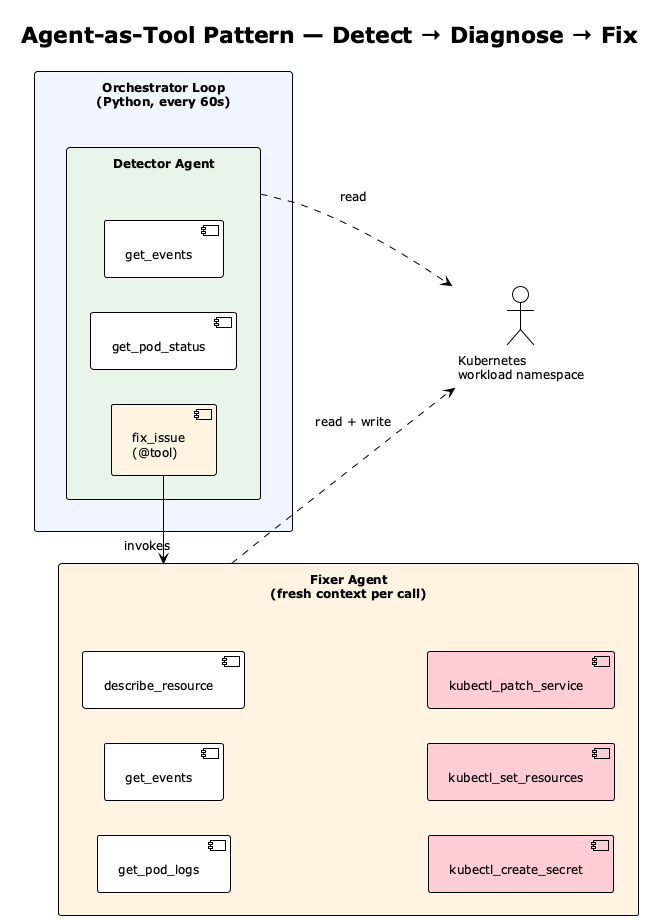
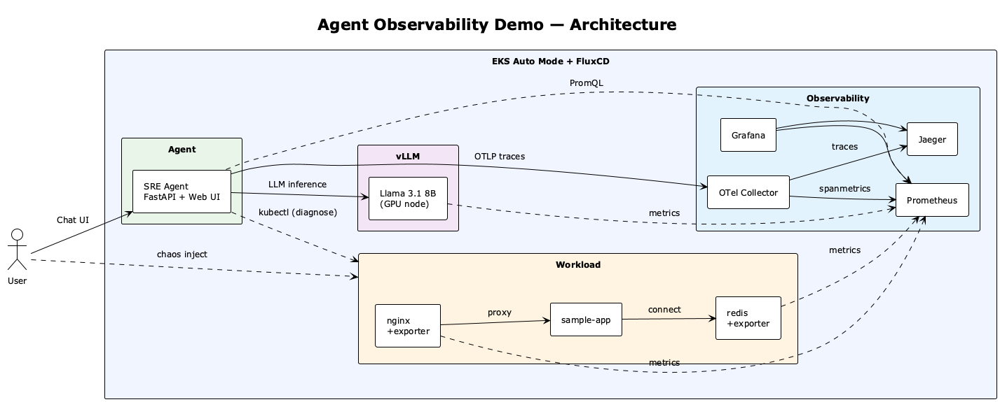

# Agent Observability Demo — SRE Agent on EKS with FluxCD

An AI-powered SRE agent that diagnoses Kubernetes failures, deployed via FluxCD GitOps on EKS Auto Mode with self-hosted LLM inference (vLLM) and fully OSS observability.

Code is provided as reference for demo purposes. In a production environment, restrict privileges according to the principle of least privilege.

## Prerequisites

- AWS account
- HuggingFace token (only needed if using vLLM with Llama)
- **Fork this repository** (Flux will commit its files to it)

## Deployment

1. **Set environment variables**:

```bash
export CLUSTER_NAME=agent-obs-demo
export AWS_DEFAULT_REGION=eu-west-2
export HF_TOKEN=<your-huggingface-token>
export GITHUB_TOKEN=<your-github-token>
export GITHUB_USER=<your-github-user>
export GITHUB_REPO=<your-forked-repo>
```

2. **Create the EKS cluster**:

```bash
cat << EOF | eksctl create cluster -f -
apiVersion: eksctl.io/v1alpha5
kind: ClusterConfig

metadata:
  name: ${CLUSTER_NAME}
  region: ${AWS_DEFAULT_REGION}

autoModeConfig:
  enabled: true

iam:
  podIdentityAssociations:
    - namespace: agent-app
      serviceAccountName: sre-agent
      createServiceAccount: false
      permissionPolicy:
        Version: "2012-10-17"
        Statement:
          - Effect: Allow
            Action:
              - "bedrock:InvokeModel"
              - "bedrock:InvokeModelWithResponseStream"
            Resource: "*"
EOF
```

3. **Build and push the SRE agent image**:

```bash
ACCOUNT_ID=$(aws sts get-caller-identity --query Account --output text)
ECR_REPO="${ACCOUNT_ID}.dkr.ecr.${AWS_DEFAULT_REGION}.amazonaws.com/${CLUSTER_NAME}/agent-app"

aws ecr create-repository --repository-name "${CLUSTER_NAME}/agent-app" --region "${AWS_DEFAULT_REGION}" 2>/dev/null || true
aws ecr get-login-password --region "${AWS_DEFAULT_REGION}" | docker login --username AWS --password-stdin "${ACCOUNT_ID}.dkr.ecr.${AWS_DEFAULT_REGION}.amazonaws.com"

docker build --platform linux/amd64 -t "${ECR_REPO}:latest" strands-agents-observability/agent-app/
docker push "${ECR_REPO}:latest"

# Tag with git SHA for Flux rollouts
GIT_SHA=$(git rev-parse --short HEAD)
docker tag "${ECR_REPO}:latest" "${ECR_REPO}:${GIT_SHA}"
docker push "${ECR_REPO}:${GIT_SHA}"
```

4. **Create secrets and Flux ConfigMap**:

```bash
kubectl create namespace vllm
kubectl create secret generic hf-token \
  --from-literal=token="${HF_TOKEN}" \
  --namespace vllm

kubectl create namespace flux-system

cat << EOF | kubectl apply -f -
apiVersion: v1
kind: ConfigMap
metadata:
  name: cluster-config
  namespace: flux-system
data:
  ECR_REPO: "${ECR_REPO}"
  IMAGE_TAG: "${GIT_SHA}"
  AWS_REGION: "${AWS_DEFAULT_REGION}"
EOF
```

5. **Bootstrap Flux**:

```bash
brew install fluxcd/tap/flux

flux bootstrap github \
  --owner=${GITHUB_USER} \
  --repository=${GITHUB_REPO} \
  --branch=main \
  --personal \
  --path=strands-agents-observability/cluster
```

6. **Monitor deployment**:

```bash
flux get kustomizations --watch
```

7. **Port-forward**:

```bash
kubectl port-forward svc/sre-agent 8000:8000 -n agent-app &
kubectl port-forward svc/grafana 3000:80 -n observability &
kubectl port-forward svc/jaeger 16686:16686 -n observability &
```

## Demo

1. Open the SRE Agent UI: http://localhost:8000
2. Open Grafana: http://localhost:3000 (admin / agent-obs-demo)
3. Open Jaeger: http://localhost:16686

Arrange all three browser windows side by side.

4. **Inject chaos**:
```bash
./strands-agents-observability/chaos/inject.sh
```

5. **Click ▶ Start** in the UI — the agent begins scanning automatically

6. **Watch the event log** — you'll see the agent in real time:
   - 🔄 Scan pods with `get_pod_status`
   - 💭 Detect unhealthy pods and reason about the issue
   - 🔧 Invoke the fixer agent with a problem description
   - 🔧 Fixer reads logs, events, describes resources
   - ✅ Fixer applies the fix (`kubectl_create_secret`, `kubectl_set_resources`, `kubectl_patch_service`)
   - 🔄 Next cycle detects the next layer

7. **Check Jaeger** — select service `sre-agent`, click "Find Traces":
   - Each cycle creates a trace with the full span waterfall
   - Detector spans with nested fixer agent spans
   - Tool call timing and inputs/outputs in span logs (click a span → "Logs" tab)

8. **Check Grafana** — the "Agent Observability" dashboard shows:
   - vLLM inference latency spiking during agent runs
   - Redis clients recovering after fixes
   - Nginx connections stabilizing

9. The agent stops automatically when all pods are healthy.

10. **Verify**:
```bash
./strands-agents-observability/chaos/verify.sh
```

### How It Works

The agent uses the **agent-as-tool** pattern from the Strands SDK with two cooperating agents:



- **Detector Agent** — lightweight scan. Calls `get_pod_status` and checks for error states (CrashLoopBackOff, OOMKilled, CreateContainerConfigError). If it finds a problem, it calls `fix_issue` with a description.
- **Fixer Agent** — wrapped as a `@tool` so the detector can invoke it. Gets a fresh context with only the problem description. Diagnoses deeper with logs and events, then applies the fix. Verifies with `get_pod_status` after.

#### Model configuration

The agent supports two model providers, configured via the `MODEL_PROVIDER` environment variable:

| Provider | Model | Pros | Cons |
|---|---|---|---|
| **bedrock** (default) | Claude Sonnet 4 | Reliable tool calling, strong reasoning, no GPU needed | API latency, pay-per-token |
| **vllm** (optional) | Llama 3.1 8B (self-hosted) | In-cluster, low latency, vLLM metrics in Grafana | Requires GPU node, weaker reasoning, needs tighter prompts |

To switch to vLLM, set `MODEL_PROVIDER=vllm` in the agent-app manifest. The vLLM deployment and GPU NodePool are included but optional when using Bedrock.

When using smaller self-hosted models, prompts need to be more prescriptive to avoid hallucinations (e.g. explicit error state allowlists, instructions to never use placeholder names). With Bedrock/Claude, the prompts can be more natural and workflow-oriented.

> **Note on FluxCD:** `inject.sh` suspends the Flux workload kustomization before injecting faults, so neither the chaos nor the agent's fixes get reverted. `verify.sh` resumes it when all checks pass.

> **Production consideration:** In production, the agent should not apply fixes directly. Instead, it would commit the fix to the Git repo (or open a PR) and let FluxCD reconcile — keeping the GitOps single source of truth. A human-in-the-loop approval step on the PR adds a safety gate before changes reach the cluster.

## Architecture



## FluxCD Dependency Chain

```
infra (Karpenter GPU NodePool)
  ├── observability (Jaeger, Prometheus, OTel Collector, Grafana)
  ├── vllm (Llama 3.1 8B on GPU — optional)
  └── workload (nginx + sample-app + redis)
        └── agent-app (SRE agent — depends on all above)
```

## Repo Structure

```
├── cluster/
│   └── development.yaml              # Flux Kustomizations + dependency chain
├── infra/
│   └── karpenter-gpu-nodepool.yaml   # GPU nodes for vLLM
├── observability/
│   ├── helm-releases.yaml            # Jaeger, Prometheus, OTel, Grafana
│   └── dashboard-configmap.yaml      # Grafana dashboard JSON
├── vllm/
│   └── deployment.yaml               # Llama 3.1 8B on GPU (optional)
├── workload/
│   └── manifests.yaml                # nginx + redis + sample-app (with exporters)
├── agent-app/
│   ├── manifests.yaml                # K8s Deployment + Service + RBAC
│   ├── app.py                        # FastAPI SRE agent (autonomous detect-fix loop)
│   ├── tools.py                      # 5 diagnostic + 3 fix tools
│   ├── static/index.html             # Auto-fix web UI
│   ├── Dockerfile
│   └── requirements.txt
└── chaos/
    ├── inject.sh                     # Inject 3 layered faults
    └── verify.sh                     # Verify workload health
```

## Updating the Agent

After changing `app.py`, `tools.py`, or `index.html`:

```bash
GIT_SHA=$(git rev-parse --short HEAD)
docker build --platform linux/amd64 -t "${ECR_REPO}:${GIT_SHA}" strands-agents-observability/agent-app/
docker push "${ECR_REPO}:${GIT_SHA}"
kubectl patch configmap cluster-config -n flux-system --type merge -p "{\"data\":{\"IMAGE_TAG\":\"${GIT_SHA}\"}}"
```

Flux detects the tag change and rolls out the new image automatically.

## Cleanup

```bash
flux uninstall
eksctl delete cluster --name ${CLUSTER_NAME} --region ${AWS_DEFAULT_REGION}
aws ecr delete-repository --repository-name "${CLUSTER_NAME}/agent-app" --region "${AWS_DEFAULT_REGION}" --force
```

## Cost

~$1.50/hr while running (mostly the GPU node). Clean up when done.
